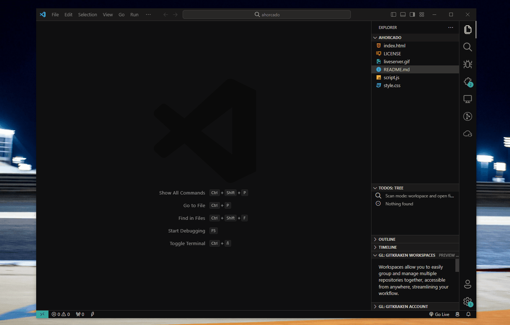

El Juego del Ahorcado hecho por: Sidney Silva Braz de Oliveira 2º DAW.

## Descripción General del Proyecto

Este es un pequeño proyecto hecho en JavaScript Vanilla en el que se desarrolla el famoso juego "El Ahorcado". 

El propósito de este proyecto es practicar todo lo que hemos aprendido sobre JavaScript durante todo este primer trimestre y hacer un juego en el cuál podremos competir con nuestros amigos.

## Requisitos

- Navegador moderno.
- Editor de código (**opcional**)

## Instalación

Para realizar la instalación, **lo primero que tendremos que hacer** será clonar este repositorio:

```git
git clone https://github.com/sxdny/ahorcado.git
```

Una vez clonado, abrimeros el archivo `.html` con nuestro navegador o editor de código favorito.



## ¿Cómo jugar?

1. Seleccionamos una de las categorías disponibles para las palabras a adivinar.
2. Adivinamos la letra sin llegar al tiempo límite o al límite de intentos.
3. Si perdemos, comenzamos otra vez.

## Caratertísticas

Las principales características del programa son las siguiente:
- Habilidad de escoger distintos tipos de palabras (por tópico).
- Almacenamiento de los datos varios usuarios. Algunos datos que se guardan son: nombre, partidas jugadas, tiempo total, etc.
- Varios tipos de palabras para adivinar.

## Funcionalidad

Desglose de la funcionalidad:

El juego espera un evento de clic en cada botón. Esto se hace utilizando el método `
addEventListener`.

Cuando se pulsa un botón, el juego comprueba si el temporizador ha comenzado (`flagContador`). Si no lo ha hecho, inicia el temporizador llamando a la función `tiempo`.

A continuación, el juego comprueba si el botón pulsado tiene la clase "letra" y no tiene la clase "seleccionada". Si se cumplen ambas condiciones, activa la clase "seleccionada" en el botón. Esto probablemente indica que la letra correspondiente ha sido seleccionada por el jugador.

La función `checkLetter` comprueba si una letra dada está incluida en la palabra a adivinar. Para ello comprueba si la versión minúscula o mayúscula de la letra está incluida en la `palabraAdivinar`.

Si la función `comprobarPalabra` devuelve verdadero (no se muestra en el código proporcionado, pero probablemente comprueba si el jugador ha adivinado correctamente la palabra), el juego detiene el temporizador, registra "¡Has ganado!" (¡Has ganado!) en la consola, y registra el estado actual de la variable `teclado` (las letras que han sido tocadas por el usuario).

La línea `intentosDOM.innerHTML = intentos` actualiza la visualización del número de intentos que ha hecho el jugador.

## Estructura


**Event Listeners**: Hay dos escuchadores de eventos que están esperando a que se haga clic en los botones. Estos botones probablemente representan las letras del alfabeto.

**Control del cronómetro**: Cuando se hace clic en un botón, el programa verifica si el cronómetro ha comenzado (`flagContador`). Si no es así, comienza el cronómetro llamando a la función ``tiempo()``.

**Selección de letras**: Si el botón clickeado tiene la clase "letra" y no tiene la clase "seleccionada", el programa alterna la clase "seleccionada" en el botón. Esto probablemente indica que la letra correspondiente ha sido seleccionada por el jugador.

**Comprobación de la palabra**: Si la función ``checkWord()`` devuelve true (verifica si el jugador ha adivinado correctamente la palabra), el programa detiene el cronómetro, registra "Has ganado!" en la consola, y registra el estado actual de la variable ``teclado``.

**Actualización de intentos**: La línea ``intentosDOM.innerHTML = intentos``; actualiza la visualización del número de intentos que el jugador ha hecho.

**Función checkLetter**: Esta función verifica si una letra dada está incluida en la palabra a adivinar. Lo hace comprobando si la versión en minúsculas o en mayúsculas de la letra está incluida en ``wordToGuess``.


